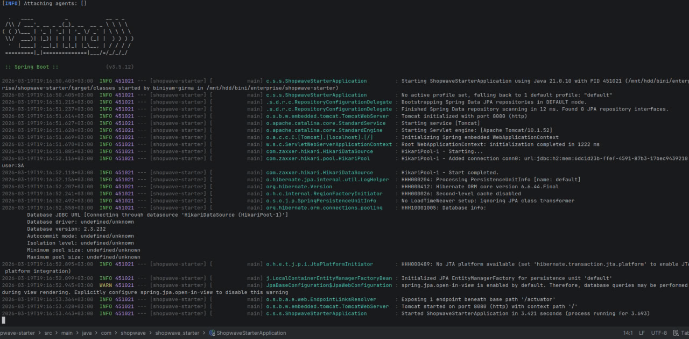
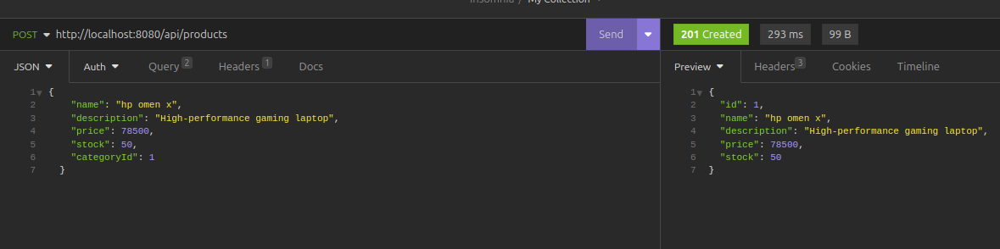
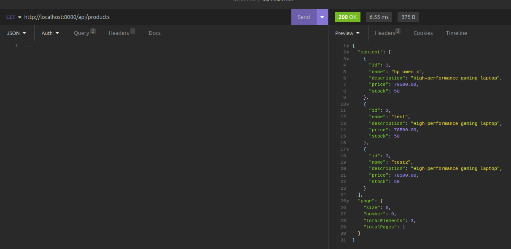
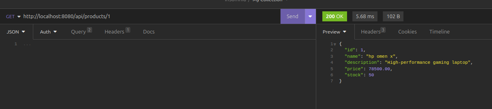
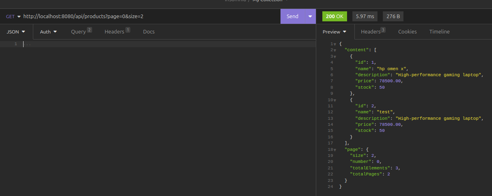
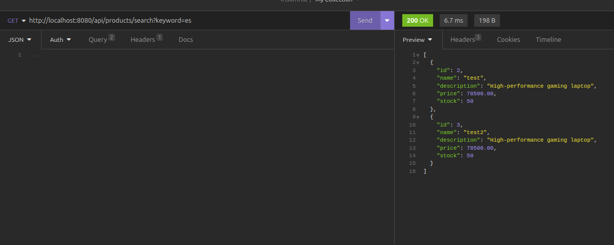
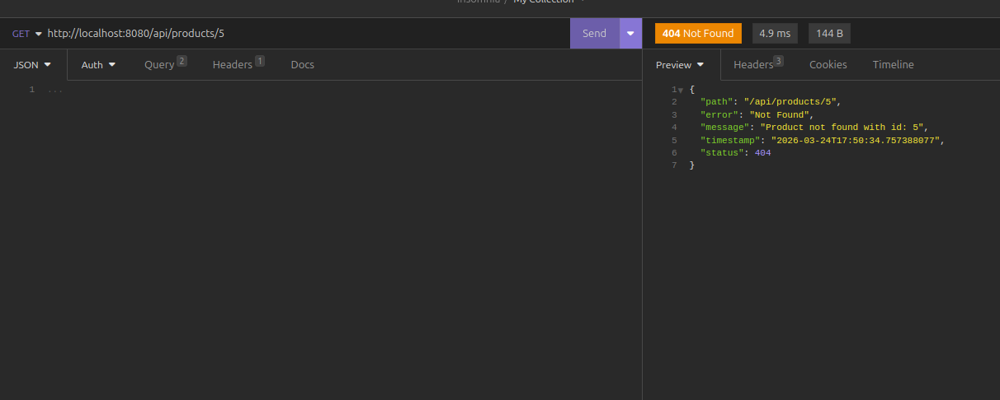
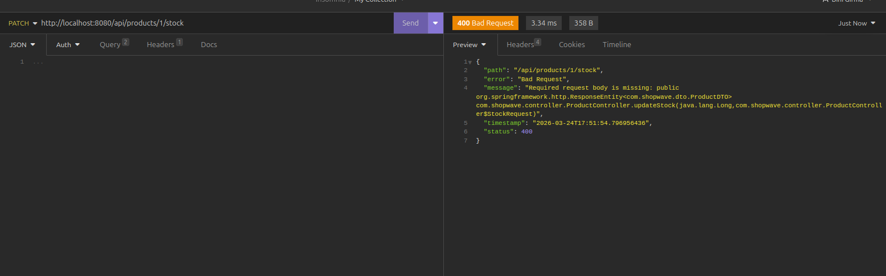
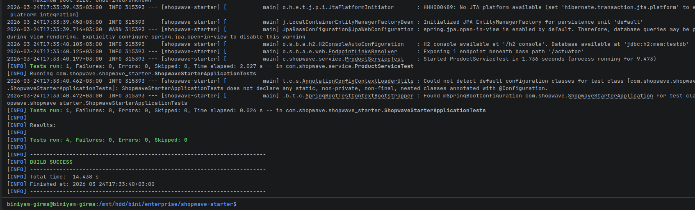

# 🛒 ShopWave Starter — SE4801 Assignment 1


---

## 👤 Student Information

* **Name:** Biniyam Girma
* **Student Number:** ATE/7146/14
* **Course:** SE 4801 — Enterprise Application Development

---

## 📌 Project Overview

ShopWave Starter is a **Spring Boot 3.x enterprise backend application** built to demonstrate real-world backend development practices.

This project implements:

* Clean layered architecture
* RESTful APIs
* Database interaction using JPA
* Exception handling
* Input validation
* Automated testing

---

## 🧱 Tech Stack

| Layer      | Technology      |
|------------|-----------------|
| Language   | Java 21         |
| Framework  | Spring Boot 3.x |
| Database   | H2 (in-memory)  |
| ORM        | Spring Data JPA |
| Build Tool | Maven           |
| Testing    | JUnit, Mockito  |

---

## 🏗️ Architecture

```id="0zj9kg"
Controller → Service → Repository → Database
```

### 🔹 Layer Responsibilities

* **Controller** → Handles HTTP requests/responses
* **Service** → Business logic
* **Repository** → Database operations
* **Model** → Entity definitions

---

## 📂 Project Structure

```id="h5yk2g"
src/main/java/com/shopwave
 ├── controller     → REST endpoints
 ├── service        → Business logic
 ├── repository     → Data access layer
 ├── model          → JPA entities
 ├── dto            → Request/Response objects
 ├── mapper         → Entity ↔ DTO conversion
 ├── exception      → Global error handling
```

---

## ⚙️ Setup Instructions

### 🔹 Clone Repository

```bash id="g0k3bg"
git clone https://github.com/abubini/se4801-assignment1-ATE-7146-14.git
cd se4801-assignment1-ATE-7146-14
```

---

### 🔹 Build Project

```bash id="6p9hhb"
mvn clean install
```

---

### 🔹 Run Application

```bash id="8t6k3r"
mvn spring-boot:run
```

App runs at:

```id="s48mnb"
http://localhost:8080
```

---

## 🧪 Running Tests

```bash id="39nlm1"
mvn test
```

---

## 📡 API Documentation

### 🔹 Get All Products

```id="5umc5s"
GET /api/products?page=0&size=10
```

---

### 🔹 Get Product by ID

```id="91bb4o"
GET /api/products/{id}
```

---

### 🔹 Create Product

```id="m8t5vw"
POST /api/products
```

```json id="hff0cn"
{
  "name": "Laptop",
  "description": "Gaming laptop",
  "price": 1500,
  "stock": 10
}
```

---

### 🔹 Search Products

```id="pd05ox"
GET /api/products/search?keyword=&maxPrice=
```

---

### 🔹 Update Stock

```id="xsv4sr"
PATCH /api/products/{id}/stock
```

```json id="plh0pl"
{
  "delta": -5
}
```

---

## 📸 API Screenshots

> 📌 Add your screenshots here (REQUIRED for assignment)

### 🔹 Application Startup




---

### 🔹 Successful API Response
### Post


### Get
localhost:8080/api/products



localhost:8080/api/products/1



localhost:8080/api/products?page=0&size=10



localhost:8080/api/products?keyword=es


---

### 🔹 Error Response Example
404 not found


bad request

---

### 🔹 Tests Passing



---

## ⚠️ Error Handling

All errors return structured JSON:

```json id="ul7rjc"
{
  "timestamp": "2026-03-23T12:00:00",
  "status": 404,
  "error": "Not Found",
  "message": "Product not found with id: 1",
  "path": "/api/products/1"
}
```

---

## 🧪 Testing Strategy

| Test Type       | Description                     |
|-----------------|---------------------------------|
| Unit Test       | ProductService (Mockito)        |
| Controller Test | ProductController (@WebMvcTest) |
| Repository Test | JPA queries (@DataJpaTest)      |

---

## 🤖 AI Usage Disclosure

This project was developed with assistance from AI tools (ChatGPT) for:

* Code structure guidance
* Debugging support
* Best practices

All outputs were:

* Reviewed
* Tested
* Understood before submission

---

## 🚀 Features Implemented

* ✅ Product CRUD operations
* ✅ Search & filtering
* ✅ Stock management
* ✅ Validation & error handling
* ✅ Layered architecture
* ✅ Unit & integration tests


---

## 🎯 Conclusion

This project demonstrates strong understanding of:

* Enterprise backend architecture
* REST API development
* Spring Boot ecosystem
* Testing and maintainability

---

⭐ *If this were a real project, you'd star it 😉*
